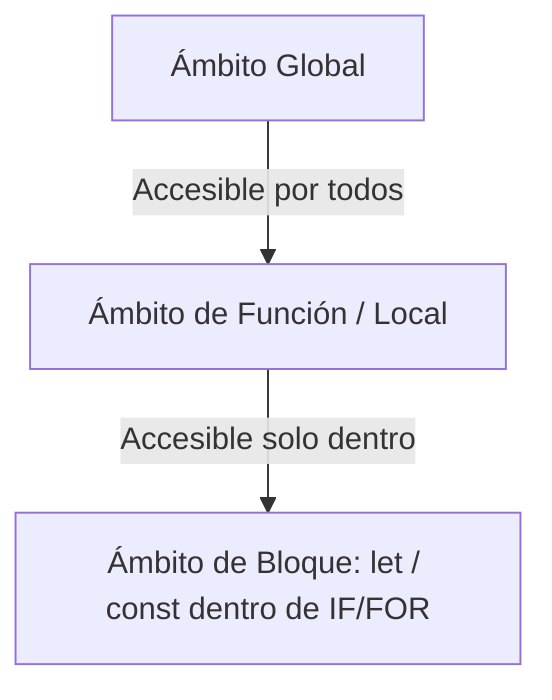

# UD 2: Sintaxis, Tipos y Funciones (RA2)

## 1. Sintaxis Básica, Variables y Tipos de Datos

JavaScript es un lenguaje de **tipado dinámico y débil**. Las variables no están ligadas a un tipo de dato fijo, sino que el tipo pertenece al valor asignado en tiempo de ejecución.

### Declaración de Variables: `var`, `let` y `const`

| Criterio | `var` | `let` | `const` |
| --- | --- | --- | --- |
| **Ámbito (*Scope*)** | Función | Bloque `{}` | Bloque `{}` |
| **Reasignable** | Sí | Sí | No (Valor fijo/Referencia constante) |
| **Redeclarable** | Sí (en el mismo ámbito) | No | No |
| **Hoisting** | Sí (inicializado como `undefined`) | Sí (en Zona Muerta Temporal - TDZ) | Sí (en Zona Muerta Temporal - TDZ) |

```javascript
// Uso recomendado en desarrollo moderno
const API_URL = "https://api.ejemplo.com/v1"; // Valor inmutable
let contador = 0;                             // Variable reasignable
contador += 1;

// const evita reasignación de referencia, pero permite mutar objetos/arrays
const usuario = { nombre: "Ana", rol: "Admin" };
usuario.nombre = "Ana María"; // VÁLIDO: Mutación de propiedad
// usuario = {};              // ERROR: TypeError (Reasignación de referencia)

```

### Tipos de Datos Primitivos y Complejos

JavaScript clasifica sus tipos de datos en dos grandes categorías:

1. **Primitivos (Inmutables, pasados por valor):**
* `Number`: Enteros y coma flotante (ej. `42`, `3.14`). Incluye valores especiales: `NaN` (*Not a Number*), `Infinity`, `-Infinity`.
* `String`: Cadenas de texto (`"texto"`, `'texto'`, ``template string``).
* `Boolean`: `true` o `false`.
* `Undefined`: Variable declarada pero sin valor asignado.
* `Null`: Ausencia intencionada de valor (representa un objeto "vacío").
* `Symbol`: Identificador único e inmutable (ES6).
* `BigInt`: Enteros de precisión arbitraria para números extremadamente grandes (`10n`).


2. **Complejos / Referencia (Mutables, pasados por referencia):**
* `Object`: Estructuras clave-valor (incluye Arrays, Funciones, Fechas, Expresiones Regulares).


### Coerción de Tipos y Comparación Estricta

JavaScript realiza conversión automática de tipos (coerción implícita) al evaluar ciertos operadores. Para evitar errores sutiles, se debe priorizar la comparación estricta (`===`) sobre la débil (`==`).

```javascript
// Coerción Implícita (Evitar)
console.log(5 + "5");     // "55" (Number se convierte a String)
console.log("10" - 2);    // 8   (String se convierte a Number)
console.log(false == 0);  // true (Coerción implícita de tipos)

// Comparación Estricta (Recomendado)
console.log(false === 0); // false (Compara valor Y tipo de dato)
console.log("10" === 10); // false

// Coerción Explícita
const numeroTexto = "42";
const numeroReal = Number(numeroTexto); // Conversión explícita a Number

```

---

## 2. Declaración e Invocación de Funciones

En JavaScript, las funciones son **ciudadanos de primera clase** (*First-Class Citizens*): se pueden almacenar en variables, pasar como argumentos y retornar desde otras funciones.

### Formas de Declarar Funciones

```javascript
// 1. Declaración de Función (Sujeta a Hoisting)
function sumar(a, b) {
  return a + b;
}

// 2. Expresión de Función (No inicializada hasta su ejecución)
const restar = function(a, b) {
  return a - b;
};

// 3. Función Flecha (Arrow Function - ES6)
const multiplicar = (a, b) => a * b; // Retorno implícito para expresiones de una línea

```

### Parámetros por Defecto y Parámetros Rest

```javascript
// Parámetros por defecto
function saludar(nombre = "Invitado", rol = "Usuario") {
  return `Hola ${nombre}, tu rol es ${rol}.`;
}

// Parámetros Rest (...args): Agrupa argumentos restantes en un Array
function calcularSumaTotal(factor, ...numeros) {
  const suma = numeros.reduce((acc, curr) => acc + curr, 0);
  return suma * factor;
}

console.log(calcularSumaTotal(2, 10, 20, 30)); // (10 + 20 + 30) * 2 = 120

```

---

## 3. Ámbitos de Variables (*Scope*) y *Hoisting*

El **ámbito** determina la accesibilidad de las variables en distintas partes del código.



### Tipos de Ámbito

1. **Global Scope:** Variables declaradas fuera de cualquier función o bloque. Accesibles desde cualquier lugar del script.
2. **Function Scope:** Variables declaradas con `var` dentro de una función. No son accesibles fuera de ella.
3. **Block Scope:** Variables declaradas con `let` y `const` dentro de un bloque `{}` (como un `if` o un bucle `for`).

```javascript
function evaluarAmbito() {
  if (true) {
    var variableVar = "Soy VAR";     // Ámbito de función
    let variableLet = "Soy LET";     // Ámbito de bloque
    const variableConst = "Soy CONST"; // Ámbito de bloque
  }
  console.log(variableVar);   // Imprime: "Soy VAR"
  // console.log(variableLet);  // ReferenceError: variableLet is not defined
  // console.log(variableConst);// ReferenceError: variableConst is not defined
}

```

### *Hoisting* y Zona Muerta Temporal (*TDZ*)

El *Hoisting* es el comportamiento del motor de JS que eleva las declaraciones de funciones y variables al principio de su ámbito durante la fase de compilación.

* **`var`:** Se eleva y se inicializa como `undefined`.
* **`let` / `const`:** Se elevan, pero **no se inicializan**. Permanecen en la **Zona Muerta Temporal (TDZ)** desde el inicio del bloque hasta que se ejecuta su declaración.

```javascript
// Comportamiento de HOISTING con var
console.log(textoVar); // Imprime: undefined (no lanza error)
var textoVar = "Hola";

// Comportamiento de TDZ con let
// console.log(textoLet); // ReferenceError: Cannot access 'textoLet' before initialization
let textoLet = "Mundo";

```

---

## 4. Contexto de Ejecución y la Palabra Clave `this`

La palabra clave `this` hace referencia al **objeto de contexto** en el que se está ejecutando el código actual. Su valor depende de *cómo* se invoca la función:

1. **Invocación directa:** `this` apunta al objeto global (`window` en navegador, `global` en Node.js) o `undefined` en *strict mode*.
2. **Invocación como método de un objeto:** `this` apunta al objeto que posee el método.
3. **Invocación con `new`:** `this` apunta a la nueva instancia creada.
4. **En *Arrow Functions*:** Las funciones flecha **no tienen su propio `this**`. Heredan el contexto `this` del ámbito léxico donde fueron creadas.

```javascript
const usuario = {
  nombre: "Carlos",
  saludarTradicional: function() {
    console.log(`Hola, soy ${this.nombre}`);
  },
  saludarFlecha: () => {
    console.log(`Hola, soy ${this.nombre}`);
  }
};

usuario.saludarTradicional(); // Imprime: "Hola, soy Carlos"
usuario.saludarFlecha();      // Imprime: "Hola, soy undefined" (hereda 'this' global)

```

---

## 5. *Closures* (Clausuras)

Un **Closure** es la combinación de una función y el entorno léxico en el que fue declarada. Permite a una función interna acceder al ámbito de su función externa incluso después de que la función externa haya finalizado su ejecución.

### Caso de Uso: Encapsulamiento y Variables Privadas

```javascript
function crearContador() {
  let contadorPrivado = 0; // Variable encapsulada (inaccesible desde fuera)

  return {
    incrementar: function() {
      contadorPrivado += 1;
      return contadorPrivado;
    },
    decrementar: function() {
      contadorPrivado -= 1;
      return contadorPrivado;
    },
    obtenerValor: function() {
      return contadorPrivado;
    }
  };
}

const miContador = crearContador();
console.log(miContador.incrementar()); // 1
console.log(miContador.incrementar()); // 2
console.log(miContador.obtenerValor());// 2
console.log(miContador.contadorPrivado); // undefined (Acceso directo bloqueado)

```

---

## 6. Funciones de Alto Orden (*Higher-Order Functions*) y Callbacks

Una **Función de Alto Orden (HOF)** es una función que acepta otras funciones como argumentos o las devuelve como resultado.

Un **Callback** es la función que se pasa como argumento a otra función para ser ejecutada posteriormente.

```javascript
// Función de Alto Orden que recibe un Callback
function procesarEntradaUsuario(nombre, callback) {
  const nombreFormateado = nombre.trim().toUpperCase();
  callback(nombreFormateado);
}

// Invocación pasando una función flecha como callback
procesarEntradaUsuario("  juan pérez  ", (nombre) => {
  console.log(`Usuario registrado: ${nombre}`);
}); // Imprime: "Usuario registrado: JUAN PÉREZ"

```