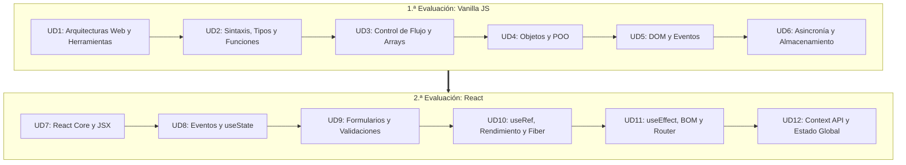
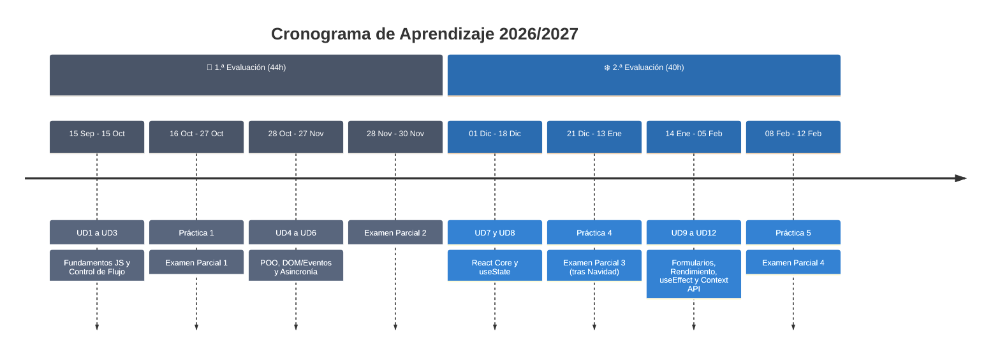

# 🚀 Desarrollo Web en Entorno Cliente (DWEC)

> **De los Fundamentos de JavaScript a la Arquitectura de Aplicaciones con React**

---

## 🖐️ Bienvenida al Curso

¡Te damos la bienvenida al módulo profesional de **Desarrollo Web en Entorno Cliente (DWEC)**!

El desarrollo frontend moderno ha dejado de ser la simple manipulación de etiquetas HTML para convertirse en una disciplina de **ingeniería de software completa**. En este curso realizarás un viaje transformador: partirás de los cimientos del lenguaje JavaScript hasta dominar la arquitectura de **Single Page Applications (SPA)** con **React**, aplicando técnicas de optimización de rendimiento y gestión de estado propias de un entorno profesional.

---

## 🗺️ Mapa Visual de Navegación del Aprendizaje

El itinerario está diseñado de forma incremental. Cada unidad construye la base de la siguiente:

---

## 📚 Estructura Detallada del Plan de Estudios

### 🟢 1.ª Evaluación: Vanilla JavaScript (63 horas)

| Unidad Didáctica | Subunidades y Bloques Temáticos | Competencia Principal |
| :--- | :--- | :--- |
| **UD 1: Arquitecturas Web y Herramientas de Desarrollo (RA1)** | Entornos de ejecución (Navegador vs. Node.js), arquitecturas cliente/servidor, editores, linter y control de versiones | Configurar el entorno de desarrollo y comprender la arquitectura cliente/servidor |
| **UD 2: Sintaxis, Tipos y Funciones (RA2)** | Gestión de memoria (`let`, `const`), tipos de datos, funciones de primera clase, *closures* y *scope* | Dominar la sintaxis básica, la tipografía de datos y la programación funcional inicial |
| **UD 3: Control de Flujo, Bucles y Arrays (RA2)** | Estructuras condicionales, iterativas y métodos funcionales de array (`map`, `filter`, `reduce`) | Implementar la lógica de control del programa y la manipulación avanzada de colecciones |
| **UD 4: Objetos y Programación Orientada a Objetos (RA3)** | Objetos literales, clases, prototipos, herencia y encapsulamiento | Diseñar modelos de datos y estructuras de código reutilizables mediante POO |
| **UD 5: DOM Nativo y Gestión de Eventos (RA4)** | Árbol DOM, manipulación dinámica, ciclo de eventos (*bubbling*, *capturing*) y delegación | Manipular el árbol del documento y gestionar la interactividad con el usuario |
| **UD 6: Asincronía y Almacenamiento — Storage/Vite (RA4)** | Event Loop, Promesas, `async/await`, API Fetch, `localStorage`/`sessionStorage` y herramientas de construcción como Vite | Integrar peticiones a APIs externas, persistencia en cliente y compilación del proyecto |

---

### 🟡 2.ª Evaluación: React (48 horas)

| Unidad Didáctica | Subunidades y Bloques Temáticos | Competencia Principal |
| --- | --- | --- |
| **UD 7: React Core, JSX y Arquitectura Frontend (RA5)** | Evolución de las arquitecturas web, Virtual DOM y Fiber, JSX, Props y Composición | Diseñar la arquitectura base de una SPA con React |
| **UD 8: Eventos y Estado con `useState` (RA5)** | Eventos sintéticos, estado local y *custom hooks* | Gestionar la interactividad y el estado de un componente |
| **UD 9: Formularios y Validaciones (RA6)** | Formularios controlados/no controlados, React Hook Form y Zod | Capturar y validar datos de usuario |
| **UD 10: `useRef`, Rendimiento y React Fiber (RA6)** | Acceso al DOM con `useRef`, `useMemo`, `useCallback`, `React.memo` y `Suspense` | Optimizar el rendimiento de renderizado |
| **UD 11: `useEffect`, BOM y React Router (RA7)** | Ciclo de vida, efectos secundarios y enrutamiento SPA | Sincronizar componentes con sistemas externos y rutas |
| **UD 12: Context API y Estado Global (RA7)** | `createContext`, `useContext`, *Prop Drilling* y comparativa con Zustand/Redux | Gestionar el estado global sin acoplamiento excesivo |

---

<!--
## 🗓️ Cronograma Temporal (12 UD — 84 Horas)

| Sem. | Fechas | Horas | Contenido / Hito |
| --- | --- | --- | --- |
| — | 15 Sep – 25 Sep | 6h | **UD1:** Arquitecturas Web y Herramientas de Desarrollo |
| — | 28 Sep – 06 Oct | 5h | **UD2:** Sintaxis, Tipos y Funciones |
| — | 07 Oct – 15 Oct | 5h | **UD3:** Control de Flujo, Bucles y Arrays |
| — | 16 Oct – 22 Oct | 2h | 📋 **Práctica 1:** Fundamentos JS y Control de Flujo |
| — | 23 Oct – 27 Oct | 2h | 📝 **Examen Parcial 1** (UD1 → UD3) |
| — | 28 Oct – 05 Nov | 6h | **UD4:** Objetos y Programación Orientada a Objetos |
| — | 06 Nov – 13 Nov | 6h | **UD5:** DOM Nativo y Gestión de Eventos |
| — | 16 Nov – 18 Nov | 2h | 📋 **Práctica 2:** POO y Manipulación del DOM |
| — | 19 Nov – 24 Nov | 6h | **UD6:** Asincronía y Almacenamiento (Storage/Vite) |
| — | 25 Nov – 27 Nov | 2h | 📋 **Práctica 3:** Asincronía y Persistencia Local |
| — | 28 Nov – 30 Nov | 2h | 📝 **Examen Parcial 2** (UD4 → UD6) |
| — | 01 Dic – 11 Dic | 5h | **UD7:** React Core, JSX y Arquitectura Frontend |
| — | 14 Dic – 18 Dic | 5h | **UD8:** Eventos y Estado con `useState` |
| — | 21 Dic – 22 Dic | 2h | 📋 **Práctica 4:** Componentes React y Estado |
| 🎄 | 23 Dic – 08 Ene | — | Vacaciones de Navidad |
| — | 11 Ene – 13 Ene | 2h | 📝 **Examen Parcial 3** (UD7 → UD8) |
| — | 14 Ene – 20 Ene | 5h | **UD9:** Formularios y Validaciones |
| — | 21 Ene – 27 Ene | 5h | **UD10:** `useRef`, Rendimiento y React Fiber |
| — | 28 Ene – 02 Feb | 5h | **UD11:** `useEffect`, BOM y React Router |
| — | 03 Feb – 05 Feb | 5h | **UD12:** Context API y Estado Global |
| — | 08 Feb – 09 Feb | 2h | 📋 **Práctica 5:** Formularios, Rendimiento y Estado Global |
| — | 10 Feb – 12 Feb | 4h | 📝 **Examen Parcial 4** (UD9 → UD12) |

---

## 🎯 Resultado de Aprendizaje Destacado (RA6)

> 💡 **Resultado de Aprendizaje 6 (RA6):**
> *"Optimiza el rendimiento de aplicaciones web en el entorno cliente controlando el ciclo de vida del dibujado, aplicando técnicas de reconciliación del Virtual DOM y gestionando accesos imperativos al DOM de forma segura."*

---

# 🔒 SECCIÓN PRIVADA — PLANIFICACIÓN Y EVALUACIÓN (DOCENTE)

> ⛔ **Uso exclusivo personal:** Esta sección no debe incluirse en la versión pública para el alumnado.

---

## 📋 Ficha Técnica del Módulo

| Parámetro | Detalle |
| --- | --- |
| **Módulo Profesional** | Desarrollo Web en Entorno Cliente (DWEC) |
| **Ciclo Formativo** | 2.º CFGS Desarrollo de Aplicaciones Web (DAW) / Multiplataforma (DAM) |
| **Carga Horaria** | 84 horas (12 Unidades Didácticas) |
| **Inicio de Clases** | 15 de septiembre de 2026 |
| **Examen Parcial 4** | 12 de febrero de 2027 |

---

## 📊 Criterios de Calificación y Evaluación

> ⚖️ **Cálculo de la Nota Trimestral:**
> * 💻 **50% Prácticas y Defensas:** Evaluación del código en GitHub, arquitectura aplicada y prueba presencial de modificación de código en vivo (para garantizar la autoría frente al uso de IA).
> * ✍️ **50% Exámenes Teórico-Prácticos:** Pruebas individuales de desarrollo de código en ordenador sin conexión a internet.
> * 📌 **Requisito Mínimo:** Es obligatorio obtener una calificación mínima de **4.0 sobre 10** en cada uno de los dos bloques para hacer media.

> 🏢 **Nota:** la planificación de la fase de FCT / FP Dual (3.ª Evaluación) y el material adicional de la UD13 se gestionan aparte de estas 84 horas y están pendientes de revisión — no se han modificado en esta actualización.
-->

