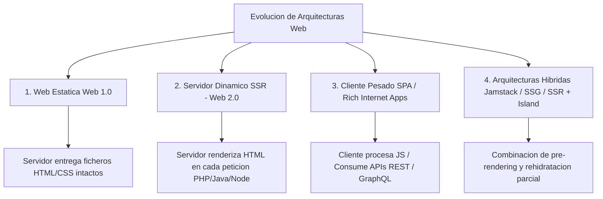
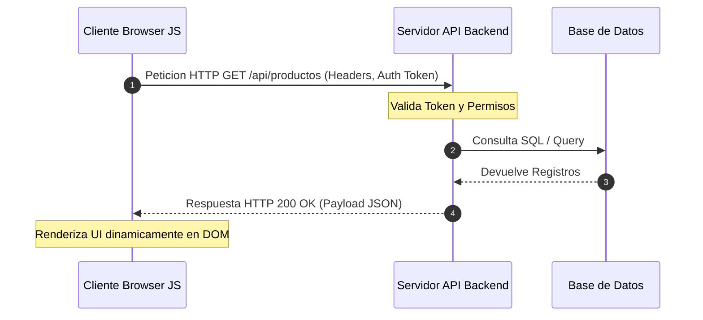
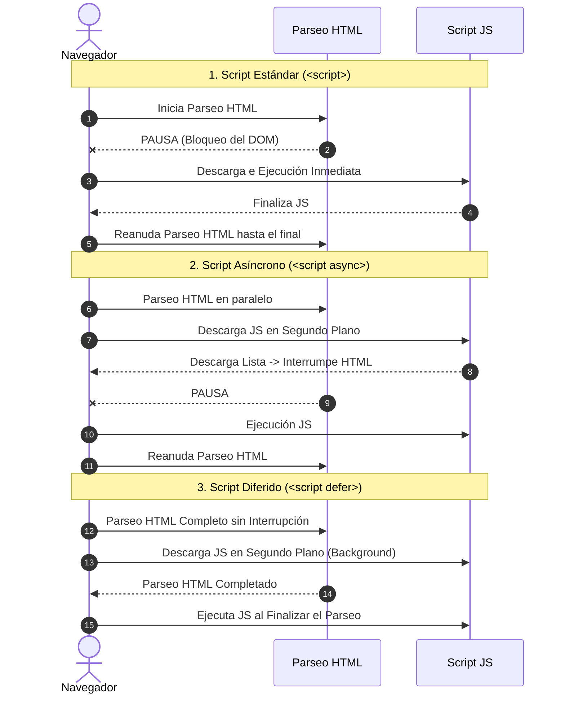
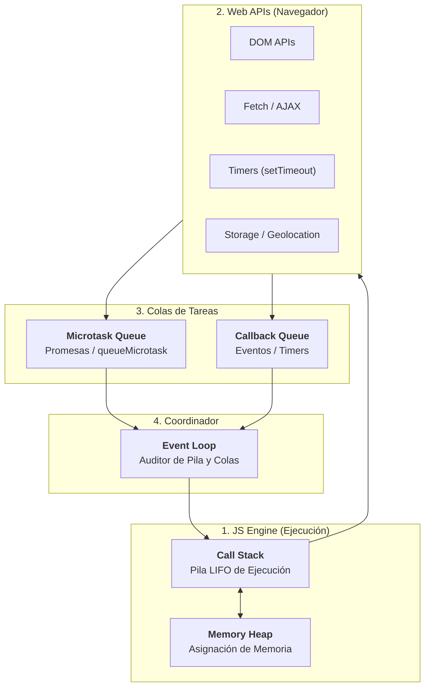
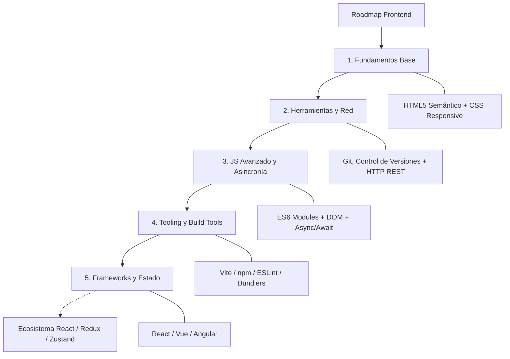
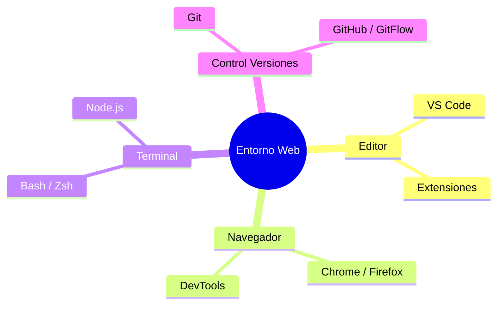
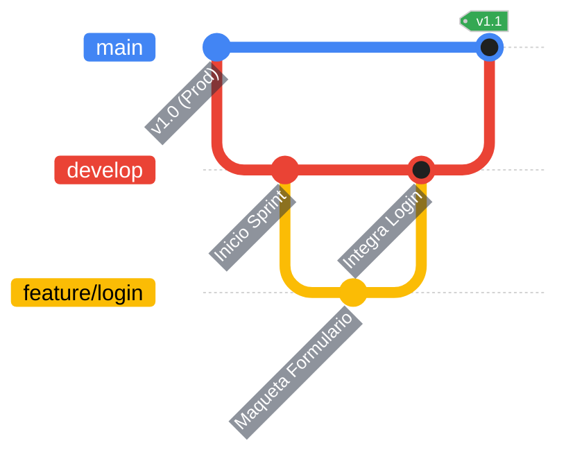

# UD 1: Arquitecturas Web y Herramientas de Desarrollo (RA1)

## 1. Evolución Detallada de las Arquitecturas Web 🌐

La arquitectura del desarrollo web ha mutado significativamente a lo largo de las décadas, desplazando progresivamente la carga de trabajo computacional desde el servidor hacia los dispositivos cliente.



### 1.1. Arquitectura Estática (Web 1.0)

* **Mecanismo:** El cliente solicita un recurso mediante una petición HTTP `GET`. El servidor consulta el sistema de archivos local y devuelve el documento HTML plano.
* **Ventajas:** Máxima velocidad de entrega, consumo nulo de CPU en servidor para renderizado, infraestructura simple.
* **Inconvenientes:** Ausencia total de interactividad avanzada, duplicación masiva de código HTML y nula capacidad para personalizar contenidos en tiempo real según el usuario.

### 1.2. Renderizado en Servidor (SSR - Server-Side Rendering)

* **Mecanismo:** Cada interacción del usuario genera una petición HTTP al servidor. Un lenguaje de backend (PHP, Java, Python, Node.js) ejecuta la lógica de negocio, realiza consultas a bases de datos relacionales o NoSQL, procesa plantillas (*templates*) y genera un documento HTML único para esa petición.
* **Ventajas:** Excelente posicionamiento SEO (el rastreador indexa contenido final) y tiempo de carga de primera pintura (*First Contentful Paint - FCP*) reducido.
* **Inconvenientes:** Alta carga de procesamiento en el servidor, acoplamiento fuerte entre frontend y backend, y experiencia de usuario fragmentada por recargas completas de pantalla (*Page Reloads*).

### 1.3. Single Page Applications (SPA) y Cliente Pesado

* **Mecanismo:** El servidor responde a la primera petición con un documento HTML esquelético e incluye un paquete compilado de JavaScript (*bundle*). Una vez ejecutado en el navegador, el código JavaScript toma el control del enrutado y el renderizado, solicitando únicamente **datos en formato JSON/XML** al servidor mediante llamadas asíncronas.
* **Ventajas:** Navegación fluida y rápida (similar a una aplicación de escritorio), reducción drástica del ancho de banda y desacoplamiento claro entre la capa visual y las APIs de backend.
* **Inconvenientes:** Inicialización más lenta (*Initial Bundle Load*), complejidad en la gestión del estado global y retos para el SEO tradicional si no se usan técnicas complementarias.

### 1.4. Paradigmas Modernos: Jamstack, SSG y Arquitectura de Islas

* **Jamstack (JavaScript, APIs, Markup):** Despliegue de sitios donde el marcado se genera previamente durante la fase de compilación (*Build time*) y la interactividad se nutre de APIs.
* **SSG (Static Site Generation):** Herramientas como Astro o Hugo compilan contenido estático antes de desplegarlo en redes CDN.
* **Arquitectura de Islas (Islands Architecture):** Paradigma donde la página es HTML puro por defecto y únicamente se "hidratan" con JavaScript interactivo las zonas estrictamente necesarias de la interfaz.

---

## 2. El Modelo Cliente/Servidor y Protocolos de Comunicación 🔄

En el entorno cliente (DWEC), se asume que la aplicación se ejecuta dentro del navegador del usuario final, lo que impone limitaciones de hardware, rendimiento y seguridad que no existen en el servidor (DWES).



### 2.1. Comparativa Integral: Frontend vs. Backend

| Dimensión | Entorno Cliente (Frontend / DWEC) | Entorno Servidor (Backend / DWES) |
| --- | --- | --- |
| **Entorno de Ejecución** | Motor JavaScript del Navegador (V8, SpiderMonkey, WebKit) | Entornos de Servidor (Node.js, Deno, JVM, PHP-FPM, Python) |
| **Recursos Computacionales** | Heterogéneos y limitados (CPU, RAM y Batería del dispositivo del cliente) | Homogéneos y escalables (Clusters, Contenedores Docker, Serverless) |
| **Nivel de Confianza / Seguridad** | **Nulo (Entorno No Confiable):** Todo el código es ejecutable, inspeccionable y manipulable. | **Alto (Entorno Confiable):** Código protegido detrás de cortafuegos y controles de acceso. |
| **Objetivo Principal** | Presentación, usabilidad (UI/UX), interacción, validación de inputs y gestión de estado. | Reglas de negocio, persistencia, transaccionalidad, cifrado y autorización. |
| **Protocolos de Entrada** | Eventos del DOM, interacciones de usuario, respuestas WebSocket/HTTP. | Peticiones HTTP/HTTPS, llamadas gRPC, colas de mensajes (AMQP, Kafka). |

### 2.2. Protocolo HTTP y Verbos REST en Desarrollo Cliente

El desarrollo frontend moderno requiere dominar las peticiones HTTP/HTTPS para intercambiar información con servicios web:

* **`GET`:** Solicta recursos. Debe ser idempotente y no incluir cuerpo en la petición.
* **`POST`:** Envía datos al servidor para crear un nuevo recurso.
* **`PUT`:** Reemplaza un recurso existente en su totalidad con los datos enviados.
* **`PATCH`:** Aplica modificaciones parciales sobre un recurso.
* **`DELETE`:** Elimina un recurso determinado del servidor.

---

## 3. Integración Avanzada de JavaScript en el Documento Web 🔗

El estándar HTML5 define formas específicas para insertar e instruir al navegador sobre la descarga e interpretación del código JavaScript.

### 3.1. Métodos de Inserción y la Regla de Separación de Capas

1. **Atributos de Evento Inline (Antipatrón):**
```html
<!-- DESACONSEJADO: Viola el principio de separacion de conceptos -->
<button onclick="alert('Hola')">Clic</button>

```


2. **Bloques `<script>` Embebidos Internos:** Útil únicamente para configuraciones iniciales críticas o pequeñas pruebas de concepto.
3. **Ficheros Externos Vía Etiqueta `<script src="...">`:** La técnica estándar y recomendada para garantizar la reutilización de código, caché HTTP y mantenibilidad.

### 3.2. Estrategias de Carga y Parseo del DOM: `async` vs `defer`

Por defecto, la lectura de etiquetas `<script>` bloquea de forma síncrona el parseador del navegador (*Parser-blocking scripts*). Para optimizar métricas de rendimientos como **FCP** (*First Contentful Paint*) y **LCP** (*Largest Contentful Paint*), se utilizan atributos asíncronos.



#### Análisis Técnico de Carga:

* **Sin Atributos (`<script src="script.js">`):** El motor interrumpe el análisis del árbol HTML inmediatamente, descarga el archivo JavaScript mediante red y lo ejecuta al instante. El parseo de HTML no se reanuda hasta que el script ha finalizado.
* **Atributo `async` (`<script src="script.js" async>`):** El archivo se descarga en segundo plano de manera asíncrona mientras se sigue analizando el HTML. **En el momento preciso en que la descarga se completa, se pausa el HTML y se ejecuta el script.**
* *Riesgo:* No respeta el orden de los archivos scripts dentro del código HTML. El archivo que descargue antes se ejecutará primero.


* **Atributo `defer` (`<script src="script.js" defer>`):** El archivo se descarga en segundo plano sin pausar el parseo HTML. **La ejecución se aplaza hasta que el documento HTML esté completamente analizado** (justo antes del evento `DOMContentLoaded`).
* *Garantía:* Preserva estrictamente el orden de declaración en el código HTML. Es la opción idónea para la inmensa mayoría de librerías y scripts de aplicación.


---

## 4. El Navegador como Entorno de Tiempo de Ejecución (*Runtime Environment*) ⚙️

Un navegador web moderno integra múltiples subsistemas que cooperan para ofrecer una plataforma de ejecución segura y multi-hilo en la capa del sistema, aunque la ejecución del código JavaScript de usuario sea de un **único hilo (*Single-Threaded*)**.



### 4.1. El Motor de JavaScript (JS Engine)

Es el componente encargado de interpretar, compilar y ejecutar el código JS.

* **Compilación JIT (Just-In-Time):** Motores como **V8** (Google Chrome, Edge, Node.js) o **SpiderMonkey** (Firefox) combinan interpretación rápida con compilación dinámica a código máquina para optimizar las funciones ejecutadas frecuentemente (*Hot functions*).
* **Call Stack (Pila de Llamadas):** Estructura de datos LIFO (*Last In, First Out*) que lleva el registro de las funciones en ejecución. Si la pila se llena por una recursión infinita, se produce el error `Stack Overflow`.
* **Memory Heap:** Región de memoria no estructurada donde se alojan los objetos, arrays y funciones declaradas. La liberación de memoria es automática gracias al **Garbage Collector** (Colector de Basura) mediante algoritmos como *Mark-and-Sweep*.

### 4.2. Entorno Asíncrono: Web APIs, Event Loop y Colas de Tareas

JavaScript es monopuntal (ejecuta un solo hilo a la vez), pero delega tareas pesadas al navegador mediante el **Event Loop**:

1. **Web APIs:** Hilos de fondo proporcionados por el navegador para procesar operaciones I/O, temporizadores y peticiones de red sin bloquear la Pila de Llamadas.
2. **Microtask Queue:** Cola de alta prioridad donde se colocan los *callbacks* de las **Promesas** (`.then()`, `async/await`) y la MutationObserver API.
3. **Callback Queue (Macrotask Queue):** Cola estándar de tareas donde se encolan eventos de usuario (`click`, `keydown`), callbacks de `setTimeout` o `setInterval`.
4. **Regla del Event Loop:** El Event Loop verifica continuamente si la Pila de Llamadas está vacía. Si está libre, procesa **primero TODAS las microtareas** acumuladas y, posteriormente, toma la **primera macrotarea** en cola.

---

# 5. El Roadmap Frontend: Mapa de Competencias Profesionales

Siguientes el estándar de la industria ([roadmap.sh/frontend](https://roadmap.sh/frontend)), el desarrollo frontend moderno requiere un dominio progresivo de conceptos ordenados por capas de abstracción:



### 5.1. Desglose del Ecosistema de Trabajo:

* **Capas Core (Fundamentos):**
* **HTML5 Semántico:** Garantiza la estructura correcta, accesibilidad universal (A11Y) y legibilidad por motores de búsqueda.
* **CSS3:** Maquetación moderna utilizando modelos de caja Flexbox, Grid Layout, variables CSS y diseño adaptativo (*Responsive Design*).


* **Control de Versiones y Protocolos:**
* Uso avanzado de **Git** (ramas, *merges*, resolución de conflictos) e interacción con repositorios remotos (GitHub/GitLab).
* Manejo del protocolo **HTTP/HTTPS**, cabeceras de autorización, cookies y políticas **CORS** (*Cross-Origin Resource Sharing*).


* **JavaScript Estándar y Módulos:**
* **ES6+ (ECMAScript 2015 en adelante):** Desestructuración, operador Rest/Spread, Clases, Módulos ES (`import`/`export`).
* Asincronía mediante Promesas y la sintaxis `async/await`.


* **Herramientas de Construcción (Build Tools & Bundlers):**
* Gestores de paquetes (`npm`, `yarn`, `pnpm`).
* Automatizadores y empaquetadores modernos como **Vite**, **Webpack** y **esbuild**, los cuales transpilan el código (Babel/TypeScript), minimizan ficheror e inyectan cambios en tiempo real (*Hot Module Replacement - HMR*).


* **Frameworks y Gestión de Estado:**
* Librerías UI para desarrollo basado en componentes reactivos (React, Vue.js, Svelte, Angular).
* Soluciones para la gestión del estado global de la aplicación (Redux, Pinia, Zustand, Context API).


---

<style>
  .mermaid {
    text-align: center;
    width: 100%;
    margin: 2rem 0;
  }
  .mermaid svg {
    max-width: 100% !important;
    height: auto !important;
    font-size: 16px !important;
  }
</style>

---

## 6. Herramientas de Desarrollo y Flujos de Trabajo 🛠️

## 6.1. Arquitectura del Entorno Local 🛠️

El desarrollo frontend moderno requiere transformar nuestro equipo en un laboratorio de pruebas idéntico al entorno de producción. 



**Node.js y NPM:** Aunque somos desarrolladores enfocados en el "Cliente", es obligatorio instalar Node.js. No lo usaremos para crear servidores (eso corresponde al Backend), sino para acceder a **NPM** (Node Package Manager). Este gestor nos permitirá descargar librerías externas, formateadores de código y empaquetadores como Vite o React en futuras unidades.

## 6.2. Visual Studio Code: Configuración Profesional

Un editor sin configurar retrasa el trabajo del equipo. Estas herramientas estandarizan el código y previenen errores antes de abrir el navegador:

| Extensión / Herramienta | Utilidad Profesional | Integración en el Curso |
| :--- | :--- | :--- |
| **ESLint** | Detecta variables sin usar, errores de sintaxis y malas prácticas. | Fundamental desde la [UD 2](ud02.md). |
| **Prettier** | Fuerza un estilo visual único (espacios, comillas, saltos de línea). | Evita discusiones de formato en equipos. |
| **GitLens** | Etiqueta cada línea de código con su autor y fecha. | Control de trabajo colaborativo. |
| **Thunder Client** | Simula peticiones HTTP (GET, POST) sin salir del editor. | Pruebas de APIs en la 2ª Eval. |

*   **Configuración de Workspace:** Guarda las preferencias del proyecto en una carpeta oculta `.vscode/settings.json`. Al añadir la regla `"editor.formatOnSave": true`, VS Code formateará automáticamente el documento con Prettier y corregirá errores menores de ESLint cada vez que el alumno guarde el archivo.

## 6.3. Depuración Avanzada con DevTools 🕵️‍♂️

El uso de `alert()` o simples impresiones en consola para buscar errores es una práctica obsoleta. Las DevTools (`F12`) ofrecen un control milimétrico sobre el flujo de ejecución.

*   **Breakpoints (Puntos de interrupción):** En la pestaña **Sources**, podemos detener la ejecución de JavaScript en una línea exacta. Esto permite inspeccionar el valor de cada variable y objeto en ese milisegundo exacto de la ejecución.
*   **Network Throttling:** En la pestaña **Network**, podemos estrangular la velocidad simulando una conexión "Slow 3G". Es vital para comprobar si la interfaz muestra correctamente los estados de carga (spinners) cuando los recursos pesados tardan en llegar.
*   **Inspección de Estado:** La pestaña **Application** será nuestro disco duro virtual para manipular directamente el almacenamiento persistente (`localStorage`) en la UD 6.

## 6.4. GitFlow y Resolución de Conflictos 🐙

En un entorno colaborativo, el código de varios desarrolladores colisiona frecuentemente. GitFlow estructura este caos mediante ramas y flujos de revisión.



*   **Conflictos de Fusión (Merge Conflicts):** Ocurren de forma natural cuando dos personas editan la misma línea del mismo archivo. Git detiene la fusión y marca el archivo en VS Code. El desarrollador debe resolverlo manualmente comparando los bloques conflictivos (*Current Change* vs *Incoming Change*) antes de poder confirmar la fusión.
*   **Pull Requests (PR):** En el ecosistema de GitHub, el código nunca se integra directamente a la rama principal. Se abre una petición (PR) para que otro compañero audite el código, proponga mejoras y apruebe la subida definitiva.
