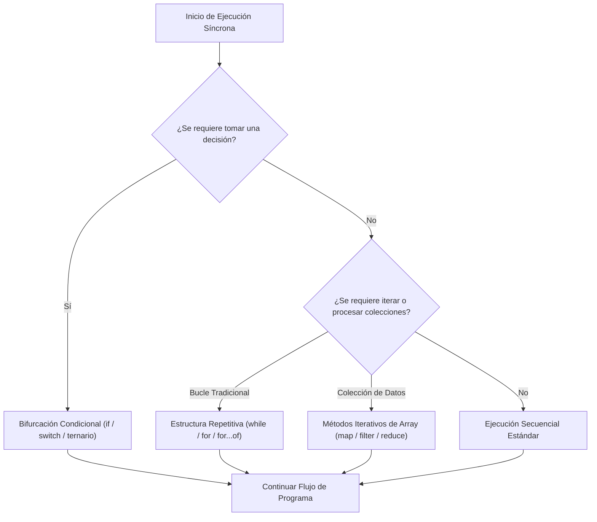
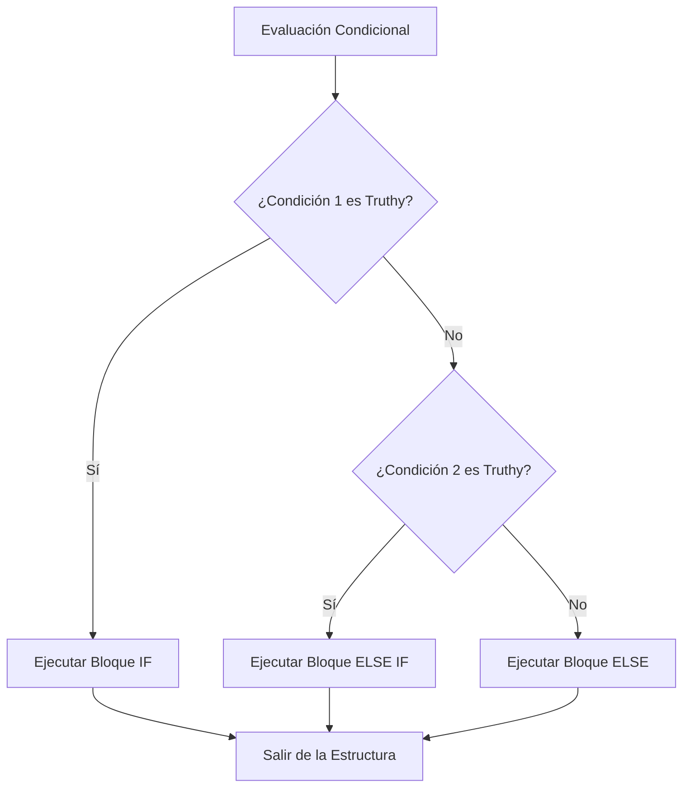
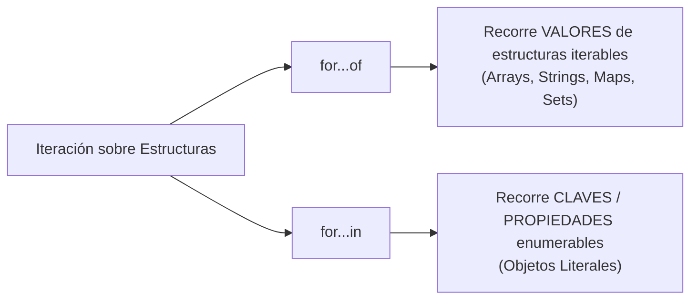
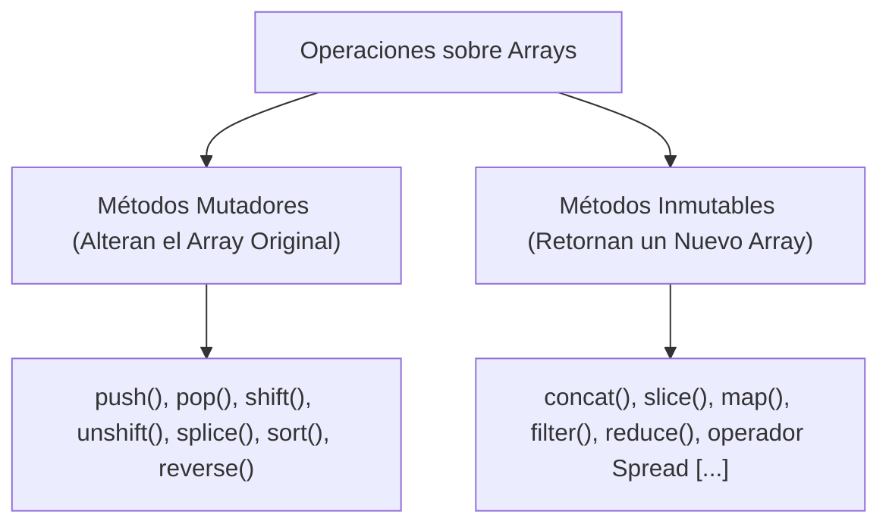

# UD 3: Control de Flujo, Bucles y Arrays (RA2)

## 1. Introducción al Control de Flujo y Modelo de Ejecución 🛤️

Por defecto, el motor de JavaScript (como V8 o SpiderMonkey) interpreta y ejecuta las instrucciones de forma **síncrona y secuencial**, siguiendo el orden estricto de las líneas en la pila de llamadas (*Call Stack*).

Sin embargo, el desarrollo frontend exige que las aplicaciones web reaccionen dinámicamente: responder a las acciones del usuario, validar respuestas de servidores, procesar colecciones de datos y renderizar interfaces condicionalmente.

Las **estructuras de control de flujo** rompen la linealidad pura de la ejecución. Se categorizan en tres bloques principales:

1. **Estructuras Condicionales (Bifurcaciones):** Evalúan condiciones lógicas para seleccionar qué camino de ejecución seguir.
2. **Estructuras Repetitivas (Bucles e Iteraciones):** Ejecutan de forma cíclica un conjunto de instrucciones mientras se cumpla un criterio de permanencia.
3. **Estructuras de Manejo de Datos (Arrays y Métodos Iterativos):** Abstraen los bucles tradicionales aplicando lógica funcional sobre listas ordenadas.



---

## 2. Evaluación Lógica y Conversión de Tipos (Truthy & Falsy) ⚖️

Cualquier condición en JavaScript se evalúa internamente en un contexto booleano (`true` o `false`). Cuando se proporciona un valor no booleano a una condición, el motor aplica una **coerción implícita de tipo** (*Type Coercion*).

### Los 8 Valores Falsy Nativos

Existen exactamente **8 valores** en todo el lenguaje que se convierten a `false`:

| Valor Falsy | Tipo de Dato | Comportamiento / Nota Técnica |
| --- | --- | --- |
| `false` | `Boolean` | Falso booleano explícito. |
| `0`, `-0` | `Number` | Cero numérico (positivo y negativo). |
| `0n` | `BigInt` | Cero en precisión arbitraria. |
| `""`, `''`, `\`` | `String` | Cadena de texto vacía (longitud 0). |
| `null` | `Null` | Ausencia intencionada de valor/referencia. |
| `undefined` | `Undefined` | Variable declarada sin inicialización. |
| `NaN` | `Number` | *Not-a-Number* (operación matemática no válida). |

### La Regla de los Valores Truthy

**Cualquier valor que no esté en la lista anterior es evaluado como `true**`, independientemente de su apariencia.

```javascript
// Ejemplos de valores TRUTHY habituales que suelen confundir a los estudiantes:
if ([]) console.log("Un array vacío es TRUTHY");
if ({}) console.log("Un objeto vacío es TRUTHY");
if ("false") console.log("El string 'false' NO está vacío, por lo que es TRUTHY");
if (-1) console.log("Cualquier número distinto de 0 (incluso negativo) es TRUTHY");

// Conversión explícita a Booleano usando la función Boolean() o la doble negación (!!)
const nombre = "Elena";
const esNombreValido = Boolean(nombre); // true
const tieneContenido = !!nombre.length; // true (longitud 5 -> true)

```

---

## 3. Estructuras Condicionales 🚦

### 3.1. Sentencias `if`, `else if` y `else`

Permiten la bifurcación lógica evaluando expresiones de arriba a abajo. Tan pronto como una condición se cumple, se ejecuta su bloque de código y el motor salta el resto de la estructura.



```javascript
// Manejo de respuesta de API con validación en cascada
const respuestaHTTP = {
  codigoEstado: 403,
  tokenValido: false,
  datos: null
};

if (respuestaHTTP.codigoEstado === 200 && respuestaHTTP.datos) {
  console.log("Cargar interfaz principal con los datos recibidos.");
} else if (respuestaHTTP.codigoEstado === 403) {
  console.warn("Acceso denegado: No dispone de permisos para este recurso.");
} else if (respuestaHTTP.codigoEstado === 401 || !respuestaHTTP.tokenValido) {
  console.warn("Sesión caducada. Redirigiendo a pantalla de Login.");
} else {
  console.error("Error no controlado en el servidor. Código:", respuestaHTTP.codigoEstado);
}

```

---

### 3.2. Operador Ternario, Cortocircuitos y Operadores Modernos

En el frontend moderno se prefieren expresiones sintácticas compactas e inmutables frente a bloques `if...else` extensos.

#### Operador Ternario (`condicion ? expr1 : expr2`)

Evalúa una expresión y retorna `expr1` si es *truthy* o `expr2` si es *falsy*.

```javascript
const edadCliente = 20;
const tipoEntrada = edadCliente >= 18 ? "Adulto" : "Infantil";

// Anidamiento de ternarios (se debe usar con precaución para mantener la legibilidad)
const nivelAcceso = edadCliente >= 65 ? "Senior" : edadCliente >= 18 ? "Estándar" : "Restringido";

```

#### Cortocircuitos Lógicos (`&&` y `||`)

Aprovechan la evaluación perezosa del motor de JavaScript para ejecutar código o asignar valores por defecto:

* **AND (`&&`):** Evalúa de izquierda a derecha. Retorna el primer valor *falsy* que encuentra. Si todos son *truthy*, retorna el último valor.
* **OR (`||`):** Evalúa de izquierda a derecha. Retorna el primer valor *truthy* que encuentra.

```javascript
// Cortocircuito && para ejecución condicional
const usuarioAutenticado = true;
usuarioAutenticado && renderizarPanelUsuario(); // Solo ejecuta la función si es true

// Cortocircuito || para valores por defecto
const nombreEntrada = "";
const nombreMostrar = nombreEntrada || "Usuario Anónimo"; // Asigna "Usuario Anónimo"

```

#### Operador de Fusión Nula (`??`) y Encadenamiento Opcional (`?.`)

El operador `||` presenta un problema cuando el valor legítimo de una variable es `0`, `false` o `""`. Para resolverlo, ES2020 introdujo `??`.

* **`??` (Nullish Coalescing):** Evalúa el lado derecho **únicamente** si el lado izquierdo es `null` o `undefined`.
* **`?.` (Optional Chaining):** Permite acceder a propiedades anidadas de un objeto sin lanzar un `TypeError` si una referencia intermedia es `null` o `undefined`.

```javascript
// Diferencia entre || y ??
const configuracionUsuario = {
  volumenNotificaciones: 0, // Cero es un valor válido elegido por el usuario
  temaOscuro: false
};

const volumenConOR = configuracionUsuario.volumenNotificaciones || 80;  // 80 (ERRÓNEO: 0 es falsy)
const volumenConNullish = configuracionUsuario.volumenNotificaciones ?? 80; // 0 (CORRECTO: preserva el 0)

// Encadenamiento Opcional combinado con Nullish Coalescing
const ciudadEnvio = usuarioAutenticado?.perfil?.direccion?.ciudad ?? "Ciudad no especificada";

```

---

### 3.3. Sentencia `switch`

Es una estructura de selección múltiple que evalúa una expresión contra diferentes cláusulas `case`. Utiliza **estrictamente la comparación de tipo y valor (`===`)**.

```javascript
const metodoPago = "STRIPE";

switch (metodoPago) {
  case "PAYPAL":
    console.log("Procesando pago mediante API de PayPal...");
    break;
  case "STRIPE":
  case "TARJETA": // Fall-through intencional para agrupar casos
    console.log("Procesando pago mediante Pasarela de Tarjeta (Stripe)...");
    break;
  case "TRANSFERENCIA":
    console.log("Generando IBAN y orden de pago diferido...");
    break;
  default:
    console.error("Método de pago no contemplado:", metodoPago);
}

```

> **Atención:** Omitir la sentencia `break` provoca un comportamiento denominado *fall-through*, donde el código continúa ejecutando los casos siguientes independientemente de si coinciden o no.

---

## 4. Estructuras Repetitivas (Bucles) 🔄

### 4.1. Bucles Condicionales: `while` y `do...while`

* **`while` (Pre-prueba):** Comprueba la condición antes de ejecutar el bloque. Si es `false` al inicio, el bloque nunca se ejecuta.
* **`do...while` (Post-prueba):** Ejecuta el bloque al menos una vez antes de verificar la condición.

```javascript
// Bucle WHILE
let intentosConexion = 0;
const maxIntentos = 3;

while (intentosConexion < maxIntentos) {
  intentosConexion++;
  console.log(`Intentando conectar con el servidor... Intento ${intentosConexion}`);
}

// Bucle DO...WHILE
let respuestaValida = false;
do {
  console.log("Validando formulario de entrada...");
  // Garantiza al menos una comprobación inicial
  respuestaValida = true;
} while (!respuestaValida);

```

---

### 4.2. Bucle `for` Tradicional

Estructura de iteración con contador explícito formado por tres partes: `inicialización; condición; incremento`.

```javascript
const productos = ["Monitor", "Teclado", "Ratón", "Altavoces"];

// Recorrido clásico indexado
for (let i = 0; i < productos.length; i++) {
  console.log(`Posición ${i}: ${productos[i]}`);
}

```

---

### 4.3. Iteración Moderna: `for...of` frente a `for...in`

Comprender la diferencia entre estas dos estructuras de ES6+ es fundamental en JavaScript:



```javascript
const listaMarcos = ["React", "Vue", "Angular"];
listaMarcos.version = "18.0"; // Propiedad añadida al objeto Array

// 1. for...of sobre Array (Recorre los VALORES de las posiciones indexadas)
for (const marco of listaMarcos) {
  console.log(marco); // Imprime: "React", "Vue", "Angular"
}

// 2. for...in sobre Objeto Literal (Recorre las CLAVES / PROPIEDADES)
const configuracionServidor = { host: "localhost", puerto: 8080, ssl: true };

for (const clave in configuracionServidor) {
  console.log(`Clave: ${clave} | Valor: ${configuracionServidor[clave]}`);
}

```

> **Buenas Prácticas:** Nunca utilices `for...in` para iterar Arrays. Además de ser significativamente más lento, iterará sobre propiedades personalizadas agregadas al prototipo del Array y no garantiza el orden numérico de los índices.

---

### 4.4. Control de Saltos: `break` y `continue`

* **`break`:** Interrumpe y finaliza inmediatamente la ejecución del bucle o `switch`.
* **`continue`:** Omite el resto de las instrucciones de la iteración actual y salta directamente a la evaluación de la siguiente iteración.

```javascript
const serieNumerica = [1, 2, 3, 4, 5, 6, 7, 8, 9, 10];

for (const numero of serieNumerica) {
  if (numero % 2 === 0) {
    continue; // Salta los números pares
  }
  if (numero > 7) {
    break; // Cancela el bucle por completo al superar el 7
  }
  console.log(`Número impar procesado: ${numero}`); // Imprime: 1, 3, 5, 7
}

```

---

## 5. Arrays en JavaScript: Manipulación y Mutabilidad 📦

Un **Array** en JavaScript es una estructura de datos ordenada y de tipo objeto especializada en almacenar colecciones de valores indexados numéricamente desde el índice `0`.

```javascript
// Declaración usando sintaxis literal (recomendada)
const lenguajes = ["JavaScript", "TypeScript", "Python"];

// Los arrays en JS son dinámicos y pueden contener tipos mixtos
const datosHeterogeneos = [42, "Texto", true, { id: 1 }, [1, 2]];

```

### Mutabilidad: Métodos Mutadores vs Inmutables

En el desarrollo de aplicaciones web con librerías reactivas como React, la distinción entre **modificar un array existente (mutación)** y **crear una nueva copia modificada (inmutabilidad)** es vital.



#### Métodos Mutadores Principales (Alteran el Array Original)

```javascript
const frutas = ["Manzana", "Plátano"];

// push / pop: Manipulación al FINAL del array
frutas.push("Naranja"); // ["Manzana", "Plátano", "Naranja"] -> Añade al final
const ultima = frutas.pop(); // Devuelve "Naranja", queda ["Manzana", "Plátano"]

// unshift / shift: Manipulación al INICIO del array (Operación O(n), menos eficiente)
frutas.unshift("Fresa"); // ["Fresa", "Manzana", "Plátano"] -> Añade al inicio
const primera = frutas.shift(); // Devuelve "Fresa", queda ["Manzana", "Plátano"]

// splice(indiceInicio, elementosABorrar, ...elementosAInsertar)
const herramientas = ["Git", "Docker", "Vite", "Webpack"];
// Elimina 2 elementos desde el índice 1 e inserta "Rollup"
herramientas.splice(1, 2, "Rollup"); 
console.log(herramientas); // ["Git", "Rollup", "Webpack"]

```

#### Métodos e Implicaciones Inmutables

```javascript
const baseDatos = ["MySQL", "PostgreSQL"];

// Copia inmutable mediante Operador Spread (...)
const nuevaBaseDatos = [...baseDatos, "MongoDB"]; // Crea un nuevo array sin modificar baseDatos

// slice(inicio, fin): Extrae una porción sin modificar el original
const lenguajesWeb = ["HTML", "CSS", "JS", "PHP", "Ruby"];
const frontendPuro = lenguajesWeb.slice(0, 3); // ["HTML", "CSS", "JS"]

```

#### El Peligro del Método `.sort()` Predeterminado

El método `.sort()` **muta el array original** y ordena los elementos convirtiéndolos a cadenas UTF-16 si no se le proporciona una función de comparación.

```javascript
const numerosDesordenados = [10, 5, 40, 25, 100];
numerosDesordenados.sort(); 
console.log(numerosDesordenados); // [10, 100, 25, 40, 5] (¡ORDENAMIENTO ALFABÉTICO INCORRECTO!)

// Corrección: Proporcionar función comparadora sintáctica (a, b) => a - b
const numerosOrdenados = [...numerosDesordenados].sort((a, b) => a - b);
console.log(numerosOrdenados); // [5, 10, 25, 40, 100] (ORDEN NUMÉRICO CORRECTO)

```

---

## 6. Métodos Iterativos de Alto Nivel (Programación Funcional) 🚀

Los métodos iterativos ejecutan una función *callback* proporcionada sobre cada elemento de la colección.

### 6.1. Recorrido con Efectos Secundarios: `forEach()`

Ejecuta la función enviada una vez por cada elemento. **No retorna nada (`undefined`)** y no debe utilizarse para transformar datos.

```javascript
const usuariosNotificar = ["Ana", "Carlos", "Beatriz"];

usuariosNotificar.forEach((usuario, indice) => {
  console.log(`Enviando notificación ${indice + 1} a ${usuario}`);
});

```

---

### 6.2. Transformación 1 a 1: `map()`

Crea un **nuevo array** de exactamente la misma longitud que el original, donde cada elemento es el resultado de transformar el elemento correspondiente.

```javascript
const preciosEuros = [10, 20, 30];
const TASA_CAMBIO_DOLAR = 1.08;

const preciosDolares = preciosEuros.map((precio) => precio * TASA_CAMBIO_DOLAR);
console.log(preciosDolares); // [10.8, 21.6, 32.4]

// Transformación de objetos en proyectos React
const usuariosServidor = [
  { id: 1, nombreCompleto: "Juan Pérez", edad: 28 },
  { id: 2, nombreCompleto: "Sara Gómez", edad: 34 }
];

const nombresParaDropdown = usuariosServidor.map((u) => ({
  value: u.id,
  label: u.nombreCompleto
}));

```

---

### 6.3. Filtrado y Selección: `filter()`

Crea un **nuevo array** que contiene únicamente aquellos elementos que devuelven un valor *truthy* al aplicar el test booleano.

```javascript
const inventarioServidores = [
  { host: "srv-01", activo: true, ramGb: 16 },
  { host: "srv-02", activo: false, ramGb: 8 },
  { host: "srv-03", activo: true, ramGb: 64 }
];

const servidoresDisponibles = inventarioServidores.filter(
  (servidor) => servidor.activo && servidor.ramGb >= 16
);
// Resultado: Contiene srv-01 y srv-03

```

---

### 6.4. Acumulación y Agregación: `reduce()`

Aplica una función reductora sobre cada elemento, pasando como argumento el retorno de la iteración previa. Reduce todo el array a **un único valor** (un número, una cadena, un objeto o un nuevo array).

```javascript
// Sintaxis: array.reduce((acumulador, elementoActual, indice, array) => { ... }, valorInicial)

const lineasFactura = [
  { concepto: "Licencia Software", importe: 150, unidades: 2 },
  { concepto: "Soporte Técnico", importe: 80, unidades: 1 },
  { concepto: "Mantenimiento Cloud", importe: 200, unidades: 3 }
];

// 1. Acumulación numérica simple
const totalFactura = lineasFactura.reduce((acumulador, linea) => {
  return acumulador + linea.importe * linea.unidades;
}, 0); // 0 es el valorInicial del acumulador

console.log("Total Factura:", totalFactura); // 300 + 80 + 600 = 980

// 2. Agrupación avanzada de objetos por propiedad usando reduce
const personas = [
  { nombre: "Laura", departamento: "IT" },
  { nombre: "Pedro", departamento: "RRHH" },
  { nombre: "Marta", departamento: "IT" }
];

const agrupadosPorDepartamento = personas.reduce((acc, persona) => {
  const depto = persona.departamento;
  if (!acc[depto]) {
    acc[depto] = [];
  }
  acc[depto].push(persona);
  return acc;
}, {}); // Objeto vacío como valorInicial

console.log(agrupadosPorDepartamento);
/*
{
  IT: [{ nombre: "Laura"... }, { nombre: "Marta"... }],
  RRHH: [{ nombre: "Pedro"... }]
}
*/

```

---

### 6.5. Búsqueda y Validación: `find()`, `findIndex()`, `some()`, `every()`, `includes()`

```javascript
const tareas = [
  { id: 101, titulo: "Configurar Linter", completada: true },
  { id: 102, titulo: "Crear Componente Header", completada: false },
  { id: 103, titulo: "Escribir Tests Unitarios", completada: false }
];

// find(): Retorna el PRIMER elemento que cumple el criterio (o undefined)
const tareaPendiente = tareas.find((t) => !t.completada);
// { id: 102, titulo: "Crear Componente Header", completada: false }

// findIndex(): Retorna el ÍNDICE de la primera coincidencia (o -1)
const indiceTarea = tareas.findIndex((t) => t.id === 103); // 2

// some(): Retorna true si AL MENOS UN elemento cumple la condición
const hayTareasPendientes = tareas.some((t) => !t.completada); // true

// every(): Retorna true si TODOS los elementos cumplen la condición
const todasCompletadas = tareas.every((t) => t.completada); // false

// includes(): Verifica la presencia de un elemento primitivo en un array
const rolesAsignados = ["ADMIN", "EDITOR"];
const esSuperusuario = rolesAsignados.includes("SUPERADMIN"); // false

```

---

## 7. Tabla Comparativa Definitiva de Métodos de Arrays 📊

| Método | Propósito Principal | Retorno | ¿Muta el Array Original? | Complejidad Temporal |
| --- | --- | --- | --- | --- |
| `forEach()` | Ejecutar efectos secundarios por cada elemento. | `undefined` | No | $O(n)$ |
| `map()` | Transformar cada elemento de la lista. | Nuevo Array (igual longitud) | No | $O(n)$ |
| `filter()` | Filtrar elementos por condición booleana. | Nuevo Array (longitud $\le n$) | No | $O(n)$ |
| `reduce()` | Acumular el array en un único resultado. | Cualquier valor/estructura | No | $O(n)$ |
| `find()` | Obtener el primer elemento coincidente. | Elemento coincidente o `undefined` | No | $O(n)$ |
| `findIndex()` | Obtener el índice de la primera coincidencia. | Entero (índice o `-1`) | No | $O(n)$ |
| `some()` | Evaluar si existe al menos una coincidencia. | Booleano (`true`/`false`) | No | $O(n)$ |
| `every()` | Evaluar si la totalidad cumple la condición. | Booleano (`true`/`false`) | No | $O(n)$ |
| `slice()` | Extraer una subsección del array. | Nuevo Array | No | $O(k)$ |
| `splice()` | Insertar, reemplazar o eliminar elementos. | Array con elementos borrados | **Sí** | $O(n)$ |
| `sort()` | Ordenar elementos según un criterio. | Array original ordenado | **Sí** | $O(n \log n)$ |
| `push()` / `pop()` | Insertar o eliminar al final. | Nueva longitud / Elemento | **Sí** | $O(1)$ |
| `unshift()` / `shift()` | Insertar o eliminar al principio. | Nueva longitud / Elemento | **Sí** | $O(n)$ |

---

## 8. Practica lo aprendido 🏋️

!!! example "Batería de ejercicios de la UD3"
    Pon a prueba todo lo visto en la unidad con la
    **[batería de ejercicios de control de flujo, bucles y arrays](ud03-1-ejercicios.md)**:
    condicionales, bucles clásicos, mutabilidad de arrays y métodos funcionales
    (`map`, `filter`, `reduce`, `find`, `some`, `every`…).
